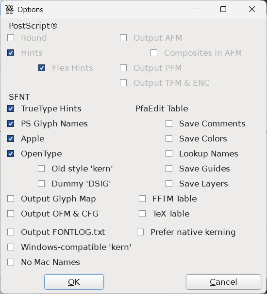

# READ ME

*This repo contains the Lisnoti font files.*

Lisnoti (/lɪzˈnəʊtiː/) is a proportional sans serif font designed for general use 
but with consideration also given to making it work

- in maths, science and actuarial contexts, and
- for writing computer code.

Lisnoti is available in regular, italic, bold and bold-italic variants in OpenType (.ttf) and web (.woff and .woff2) formats under the [SIL Open Font Licence (OFL)](https://openfontlicense.org/).

There is also a version ('Lisnoti Code WS') where the space character is 40% wider, which may be more to your taste in a coding context.

If you're interested in why Lisnoti exists, please see [this article](https://timgord.com/2024-01/lisnoti-a-proportional-font-that-works-for-coding-too/).

## Installing Lisnoti

If you want to install Lisnoti on machines for local use then the OpenType font files are zipped [here](https://github.com/Lisnoti/Lisnoti/raw/refs/heads/main/Lisnoti-OpenType.zip/).

The alternative wider space version is [here](https://github.com/Lisnoti/Lisnoti/raw/refs/heads/main/LisnotiCodeWS-OpenType.zip/). (You can install both at the same time to see which you prefer.)

If you want to use Lisnoti for your website then [this page sets out how to do this](https://lisnoti.com/index.html#using-lisnoti-for-websites).

## Feedback

If you have comments on Lisnoti, please use [the GitHub repo discussions page](https://github.com/Lisnoti/Lisnoti/discussions). 

Please bear in mind that I am not a typography expert, just a frustrated user.

## Key features

*Please bear in mind that this readme file is not itself typeset in Lisnoti, and so the character representations you see below are **not** the same as if they were in Lisnoti. A more accurate depiction is available [here](https://lisnoti.com/index.html#key-features).*

Lisnoti is derived from [Noto's sans serif fonts](https://fonts.google.com/noto/), but with the following adaptions:

1. Reliable distinction of upper case `I` and lower case `l`, and upper case `O` and zero `0`.

1. Consistent arithmetic, comparison, logic, set, *n*-ary and other maths operators, e.g. 

    - arithmetic: `− × ÷ ± ∓ ∞` (*NB Noto Sans gets the minus sign wrong*)
    - comparison: `≤ ≠ ≥ ≈ ≡ ≢ ∝`
    - logic: `¬ ∧ ∨ ⊻ ⊤ ⊥ ⊦`
    - set: `∩ ∪ ∈ ∉ ⊂ ⊃ ⊆ ⊇ ∅`
    - *n*-ary: `∑ ∏ ⋀ ⋁  ⋂ ⋃`
    - other: `∫ ∂ √ Δ ∇ ∀ ∃`

1. Greek and Cyrillic letters -- maths and logic make frequent use of Greek letters and occasionally Cyrillic ones too.

1. Consistently formatted digit and -- if available -- Roman letter sub and superscripts:

    - superscript: `⁰¹²³⁴⁵⁶⁷⁸⁹⁽⁾⁺⁻ᵃᵇᶜᵈᵉᶠᵍʰⁱʲᵏˡᵐⁿᵒᵖ𐞥ʳˢᵗᵘᵛʷˣʸᶻᴬᴮꟲᴰᴱꟳᴳᴴᴵᴶᴷᴸᴹᴺᴼᴾꟴᴿᵀᵁⱽᵂ𐞲`
    - subscript: `₀₁₂₃₄₅₆₇₈₉₍₎₊₋ₐₑₕᵢⱼₖₗₘₙₒₚᵣₛₜᵤᵥ₝ₓ₞₟`

1. A reasonable selection of symbols, including

    - squares, diamonds, rectangles, triangles, circles and stars: `■□▪▫▬▭▮▯▰▱▲△▴▵▶▷▸▹►▻▼▽▾▿◀◁◂◃◄◅◆◇◊○◌●◦◯◻◼◽◾⚪⚫⚬★☆`
    - lots of arrows: `←↑→↓↔↕ ↖↗↘↙ ⇄ ⇅ ⇵ ⇆ ⇋⇌ ⇐ ⇒⇔ ⇦⇧⇨⇩  ￩￪￫￬`
    - ticks and crosses: `☐☑☒ ✓✔✕✖✗✘`
    - box drawing: `─│┌┐└┘├┤┬┴┼╭╮╯╰╱╲╳╴╵╶╷`
    - game characters: `♔♕♖♗♘♙♚♛♜♝♞♟ ♠♡♢♣♤♥♦♧`
    - misc but useful: `⌂☸ ♩♪♫♬♭♮♯ ♀♂⚢⚣⚤⚥⚦⚧⚨⚩⚭⚮⚯⚲ ⌘ ␣ ☉ ♿ 円圓`

1. All the operators [parsed by Julia](https://github.com/JuliaLang/julia/blob/master/src/julia-parser.scm) (which is itself a good test of a technical font).

1. [Unicode mathematical alphanumeric symbols](https://en.wikipedia.org/wiki/Mathematical_Alphanumeric_Symbols), e.g. `𝐀𝐴𝑨 𝒜𝒲𝓐 𝔄 𝔸 𝕬 𝖠𝗔𝘈𝘼 𝙰`.

(If you want all the above but with a monospaced font, then take a look at [Julia Mono](https://juliamono.netlify.app/).)

## Construction

Lisnoti was constructed from various Noto Sans fonts using [FontForge](https://fontforge.org/).

This a summary of the steps I went through:

1. I started with [`Noto Sans`](https://fonts.google.com/noto/specimen/Noto+Sans) in (non-variable) regular, bold, italic and bold-italic. All edits below apply to all four of these.

1. Bold and italic symbols:

    - [Noto Sans Math](https://fonts.google.com/noto/specimen/Noto+Sans+Math) and [Noto Sans Symbols 2](https://fonts.google.com/noto/specimen/Noto+Sans+Symbols+2) are available only as regular fonts and so I used FontForge with a weight increase of 28 to create bold versions of these (and, for symbol consistency [Noto Sans Symbols](https://fonts.google.com/noto/specimen/Noto+Sans+Symbols) even though that does have a bold version).
    - For [Noto Sans JP](https://fonts.google.com/noto/specimen/Noto+Sans+JP), I used the existing bold version.
    - I did *not* create italic versions of these symbols -- apart from a few special cases, Lisnoti symbols do *not* vary as italic.

1. Somewhere between FontForge and Noto Sans, the mark set used as a prior condition for the GPOS kerning tables with names ending 2 to 6 (including Latin, Greek and Cyrillic) gets messed up, which meant kerning didn't work in the emitted files. I've changed this to 'All'.

1. Glyph edits to reduce ambiguity:

    - Added a dot inside zero `0` (the dot being copied from `U+22C5` in Noto Sans Math).
    - Added a tail to lower case `l` (consistent with iota) and made follow on adjustments to standard ligatures `fl` (`U+FB02`) and `ffl` (`U+FB04`) and the accented `ḷ` (`U+1E37`), `ḹ` (`U+1E39`), `ḻ` (`U+1E3B`) and `ḽ` (`U+1E3D`).
    - The Noto Sans lower case alpha `α` (`U+03B1`) looks too similar to a lower roman letter `a` (particularly in italic), so I copied the version from Noto Sans JP.
    - I increased the size of middle dot by 50% -- otherwise it is too small and narrow to indicate multiplication.

1. Kerning adjustments:
    - Added positive `r`/`n` pair kerning to avoid confusion with `m` (which has happened to me IRL).
    - Reduced the very aggressive `r`/`.` pair kern value by 50% because the full stop in code like `other.value` is hard to see.
    - Added positive mutual class kerning for brackets of the same orientation so that consecutive `(`/`[`/`{` will space out and similarly so will consecutive `)`/`]`/`}`.
    - Added positive pair kerning for all combinations of  `'` and `"` so that `''` doesn't look like `"` etc. (In Visual Studio, this kerning doesn't seem to be used in actual C# code, but it does work in the comments.)
    - Added some negative class kerning for the classes containing `A` and `v` (solely because this is fairly standard and it seemed odd that it is not already present in Noto Sans).

1. Instead of including a correct glyph for minus sign `−` (`U+2212`), Noto Sans actually references the hyphen glyph(!). So I drew a new `U+2212` based on the plus sign.

1. Super and sub-script consistency:

    -  Noto Sans super and sub-script letters and digits are out of alignment.
    -  I used using a FontForge script to recreate all of these superscripts from the full size versions (for Roman letters only -- I left others, e.g. Greek alone). Subscripts are implemented as references to the corresponding superscripts.
    -  For the regular font, the FontForge transform mangled the superscript `T`, `c`, `f`, `t`, `y`, which required hand-editing to clean them up.
    -  I've since (2025-05-22) added superscript `q` (U+107A5) and superscript `Y` (U+107B2), and (approved by Unicode in November 2024) subscripts `w` (U+209D), `y` (U+209E) and `z` (U+209F).

1. Issues with other maths symbols:

    - The Noto Sans Math proportional to symbol `∝` (`U+221D`) looks oddly small, so I copied the infinity symbol `∞` (`U+221E`) and chopped off the right-hand end, which means it is now consistent with e.g. `=`.
    - That said, I think the infinity symbol `∞` (`U+221E`) is itself on the small side for use as a value, and so I scaled it by 1.125.
    - The Noto Sans Math intersection `∩` (U+2229) and union `∪` (U+222A) symbols are taller than the three standard logical ops *and* `∧`(U+2227), *or* `∨` (U+2228) and *xor* `⊻` (U+22BB) operators and other operators, e.g. `+−×÷`. So I've lowered the tops to match the logical ops.
    - The *n*-ary logical and set operators `⋀` (`U+22C0`), `⋁` (`U+22C1`), `⋂` (`U+22C2`) and `⋃` (`U+22C3`) in Noto Sans Math are not sufficiently distinctive from the equivalent binary operators (`∧`, `∨`, `∩` and `∪`) and are also inconsistent with the *n*-ary summation `∑` (`U+2211`) and product `∏` (`U+220F`) from Noto Sans Math. So I redrew them using the *n*-ary product `∏` (`U+220F`) from Noto Sans Math as a guide.
    - Arrows
      - Noto Sans Math arrows are very small and so I've scaled them by 1.25 so that their stems are broadly the same width as e.g. maths symbols such as equals and minus sign. (*I originally copied the arrows from Noto Sans JP, but they are a subset of the arrows in Noto Sans Math, leaving the remaining ones from Noto Sans Math inconsistent.*)
      - Noto Sans Math does not contain 'white' arrows such as `⇨` (U+21E8) and so I've copied these from Noto Sans Symbol 2 and emboldened them (because the outlines are two thin).
      - Neither Noto Sans Math nor Noto Sans Symbol 2 contain half width arrows, i.e. `￩` (U+FFE9) to `￬` (U+FFEC), and so these are copied from Noto Sans JP.
      - The downwards zigzag arrow, `↯` (U+21AF) is copied from Noto Sans Symbol 2 and scaled by 1.3.
    - The Noto Sans colon equals symbol `:=` (`U+2254`) is very narrow and hence hard to read. I've re-drawn it using the underlying characters (but re-centred the colon vertically). I made similar changes to `≕` (`U+2255`) and I added `⩴` (`U+2A74`) (because this is parsed by Julia).
    - On the basis that it is a potentially useful operator in the Unicode Mathematical Operators block but was not present in Noto Sans Math, I added the diameter sign `⌀` (`U+2300`) by scaling the empty set symbol `∅` (`U+2205`) from Noto Sans Math. 
    - I replaced the `Δ` (`U+394`) in Noto Sans with its equivalent from Noto Sans Math so that math symbols are consistent (given that I ultimately paste in the rest of Noto Sans Math).

1. Symbols copied from other Noto Sans fonts:

    - [Noto Sans Symbols](https://fonts.google.com/noto/specimen/Noto+Sans+Symbols): `⌂` (`U+2302`), `☸` (`U+2638`), `♀` (`U+2640`), `♂` (`U+2642`), `♩` (`U+2669`), `♪` (`U+266A`), `♫` (`U+266B`), `♬` (`U+266C`), `♭` (`U+266D`), `♮` (`U+266E`), `♯` (`U+266F`), `⚢` (`U+26A2`), `⚣` (`U+26A3`), `⚤` (`U+26A4`), `⚥` (`U+26A5`), `⚦` (`U+26A6`), `⚧` (`U+26A7`), `⚨` (`U+26A8`), `⚩` (`U+26A9`), `⚭` (`U+26AD`), `⚮` (`U+26AE`), `⚯` (`U+26AF`), `⚲` (`U+26B2`), 

    - [Noto Sans Symbols 2](https://fonts.google.com/noto/specimen/Noto+Sans+Symbols+2): `☐` (`U+2610`), `☑` (`U+2611`), `☒` (`U+2612`), `⌘` (`U+2318`), `␣` (`U+2423`), `■` (`U+25A0`), `□` (`U+25A1`), `▪` (`U+25AA`), `▫` (`U+25AB`), `▬` (`U+25AC`), `▭` (`U+25AD`), `▮` (`U+25AE`), `▯` (`U+25AF`), `▰` (`U+25B0`), `▱` (`U+25B1`), `▲` (`U+25B2`), `△` (`U+25B3`), `▴` (`U+25B4`), `▵` (`U+25B5`), `▶` (`U+25B6`), `▷` (`U+25B7`), `▸` (`U+25B8`), `▹` (`U+25B9`), `►` (`U+25BA`), `▻` (`U+25BB`), `▼` (`U+25BC`), `▽` (`U+25BD`), `▾` (`U+25BE`), `▿` (`U+25BF`), `◀` (`U+25C0`), `◁` (`U+25C1`), `◂` (`U+25C2`), `◃` (`U+25C3`), `◄` (`U+25C4`), `◅` (`U+25C5`), `◆` (`U+25C6`), `◇` (`U+25C7`), `◊` (`U+25CA`), `○` (`U+25CB`), `◌` (`U+25CC`), `●` (`U+25CF`), `◦` (`U+25E6`), `◯` (`U+25EF`), `◻` (`U+25FB`), `◼` (`U+25FC`), `◽` (`U+25FD`), `◾` (`U+25FE`), `★` (`U+2605`), `☆` (`U+2606`), `☉` (`U+2609`), `♔` (`U+2654`), `♕` (`U+2655`), `♖` (`U+2656`), `♗` (`U+2657`), `♘` (`U+2658`), `♙` (`U+2659`), `♚` (`U+265A`), `♛` (`U+265B`), `♜` (`U+265C`), `♝` (`U+265D`), `♞` (`U+265E`), `♟` (`U+265F`), `♠` (`U+2660`), `♡` (`U+2661`), `♢` (`U+2662`), `♣` (`U+2663`), `♤` (`U+2664`), `♥` (`U+2665`), `♦` (`U+2666`), `♧` (`U+2667`), `♿` (`U+267F`), `⚪` (`U+26AA`), `⚫` (`U+26AB`), `⚬` (`U+26AC`), `✓` (`U+2713`), `✔` (`U+2714`), `✕` (`U+2715`), `✖` (`U+2716`), `✗` (`U+2717`), `✘` (`U+2718`), 

    - [Noto Sans JP](https://fonts.google.com/noto/specimen/Noto+Sans+JP): `─` (`U+2500`), `│` (`U+2502`), `┌` (`U+250C`), `┐` (`U+2510`), `└` (`U+2514`), `┘` (`U+2518`), `├` (`U+251C`), `┤` (`U+2524`), `┬` (`U+252C`), `┴` (`U+2534`), `┼` (`U+253C`), `╭` (`U+256D`), `╮` (`U+256E`), `╯` (`U+256F`), `╰` (`U+2570`), `╱` (`U+2571`), `╲` (`U+2572`), `╳` (`U+2573`), `╴` (`U+2574`), `╵` (`U+2575`), `╶` (`U+2576`), `╷` (`U+2577`), `円` (`U+5186` ), `圓` (`U+5713`), `￩` (`U+FFE9`) , `￪` (`U+FFEA`) , `￫` (`U+FFEB`) , `￬` (`U+FFEC`) 

1. Finally, I merged in all characters from [Noto Sans Math](https://fonts.google.com/noto/specimen/Noto+Sans+Math) not already present after the above changes.

1. The font files were generated with these options in FontForge:

    

