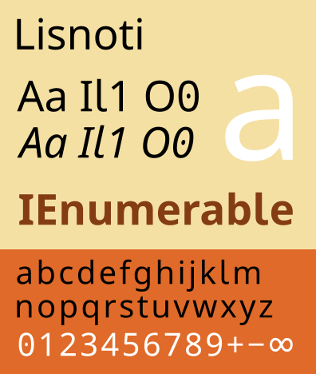

# READ ME

This repo contains the Lisnoti font files.

Lisnoti is a proportional sans serif font derived from the [Noto sans serif fonts](https://fonts.google.com/noto/) and is intended for both general use and for writing computer code (including in a maths/science context).

Lisnoti is available in regular, italic, bold and bold-italic variants in OpenType (`.ttf`) and web (`.woff` and `.woff2`) formats under the [SIL Open Font Licence (OFL)](https://openfontlicense.org/).

I've tested Lisnoti on Windows and Apple, but not on Linux.

If you're interested in the background to Lisnoti, please see [my blog article](https://timgord.com/2024-01/lisnoti--a-proportional-font-that-works-for-coding-too/).

## Key features

Lisnoti incorporates the following:

1. Reliable distinction of 

    - upper case `I` and lower case `l`, and
    - upper case `O` and zero `0`.

1. Consistent arithmetic, comparison, logic, set, n-ary and other maths operators, e.g. 

    - arithmetic: `− × ÷ ± ∓ ∞`
    - comparison: `≤ ≠ ≥ ≈ ≡ ≢ ∝`
    - logic: `¬ ∧ ∨ ⊻ ⊤ ⊥ ⊦`
    - set: `∩ ∪ ∈ ∉ ⊂ ⊃ ⊆ ⊇ ∅`
    - n-ary: `∑ ∏ ⋀ ⋁  ⋂ ⋃`
    - other: `∫ ∂ √ Δ  ∇ ∀ ∃`

1. Greek and Cyrillic letters -- maths and logic make frequent use of Greek letters and occasionally Cyrillic ones too.

1. Consistently formatted digit and -- if available -- Roman letter sub and superscripts and , e.g. 

    - superscript: `⁰¹²³⁴⁵⁶⁷⁸⁹⁽⁾⁺⁻ ᵃᵇᶜᵈᵉᶠᵍʰⁱʲᵏˡᵐⁿᵒᵖʳˢᵗᵘᵛʷˣʸᶻ ᴬᴮᴰᴱᴳᴴᴵᴶᴷᴸᴹᴺᴼᴾᴿᵀᵁⱽᵂ`
    - subscript: `₀₁₂₃₄₅₆₇₈₉₍₎₊₋ ₐₑₕᵢⱼₖₗₘₙₒₚᵣₛₜᵤᵥₓ`

1. A reasonable selection of symbols, including

    - squares, diamonds, rectangles, triangles, circles and stars: `■□▪▫▬▭▮▯▰▱▲△▴▵▶▷▸▹►▻▼▽▾▿◀◁◂◃◄◅◆◇◊○◌●◦◯◻◼◽◾⚪⚫⚬★☆`
    - arrows: `←↑→↓↔↕ ↖↗↘↙ ⇄ ⇅ ⇵ ⇆ ⇋⇌ ⇐ ⇒⇔ ⇦⇧⇨⇩  ￩￪￫￬`
    - ticks and crosses: `☐☑☒ ✓✔✕✖✗✘`
    - box drawing: `─│┌┐└┘├┤┬┴┼╭╮╯╰╱╲╳╴╵╶╷`
    - game characters: `♔♕♖♗♘♙♚♛♜♝♞♟ ♠♡♢♣♤♥♦♧`
    - misc but useful: `⌂☸ ♩♪♫♬♭♮♯ ♀♂⚢⚣⚤⚥⚦⚧⚨⚩⚭⚮⚯⚲ ⌘ ␣ ☉ ♿ 円圓`

1. All the operators [parsed by Julia](https://github.com/JuliaLang/julia/blob/master/src/julia-parser.scm).

1. [Unicode mathematical alphanumeric symbols](https://en.wikipedia.org/wiki/Mathematical_Alphanumeric_Symbols), e.g. `AAAA 𝐀𝐴𝑨 𝒜𝒲𝓐 𝔄 𝔸 𝕬 𝖠𝗔𝘈𝘼 𝙰`.

(If you want all the above but you're happy with a monospaced font, then I suggest you try [Julia Mono](https://juliamono.netlify.app/).)

## Construction

Lisnoti was constructed from various Noto Sans fonts using [FontForge](https://fontforge.org/).

I've set out the steps I went through below.

1. I started with [`Noto Sans`](https://fonts.google.com/noto/specimen/Noto+Sans) in regular, bold, italic and bold-italic. All edits below apply to all four of these.

1. Bold and italic symbols:

    - [Noto Sans Math](https://fonts.google.com/noto/specimen/Noto+Sans+Math) and [Noto Sans Symbols 2](https://fonts.google.com/noto/specimen/Noto+Sans+Symbols+2) are available only as regular fonts and so I used FontForge with a weight increase of 28 to create bold versions of these (and, for consistency [Noto Sans Symbols](https://fonts.google.com/noto/specimen/Noto+Sans+Symbols) even though that does have a bold version).
    - For [Noto Sans JP](https://fonts.google.com/noto/specimen/Noto+Sans+JP), I used the existing bold version.
    - I did *not* create italic versions of these symbols -- apart from a few special cases, Lisnoti symbols do *not* vary as italic.

1. Somewhere between FontForge and Noto Sans, the mark set used as a prior condition for the GPOS kerning tables with names ending 2 to 6 (including Latin, Greek and Cyrillic) gets messed up, which means no kerning. I've changed this to 'All'.

1. Edits for lack of ambiguity:

    - Added a dot inside zero `0` (copied from `U+22C5` in Noto Sans Math).
    - Added a tail to lower case `l` (consistent with iota) and made the follow on adjustments to standard ligatures `fl` (`U+FB02`) and `ffl` (`U+FB04`) and the accented `ḷ` (`U+1E37`), `ḹ` (`U+1E39`), `ḻ` (`U+1E3B`) and `ḽ` (`U+1E3D`).
    - The Noto Sans lower case alpha `α` (`U+03B1`) looks too similar to a lower roman letter `a` (particularly in italic), so I copied the version from from Noto Sans JP.
    - I increased the size of middle dot by 50% -- otherwise it is too small and narrow to indicate multiplication.
  - I added extra space for `r`-`n` kerning (to avoid confusion with `m`). (I also added some negative kerning for the kerning classes containing `A` and `v` as it seemed odd that this is not already present in Noto Sans.)

1. Noto Sans does not have the correct glyph for minus sign `−` (`U+2212`). I changed this to be consistent with the plus sign.

1. Sub and super script consistency:

    -  Noto Sans super and sub script letters and digits are out of alignment.
    -  I used using a FontForge script to recreate these from scratch (for Roman letters only -- I left others, e.g. Greek alone).
    -  For the regular font, this mangled superscript `T`, `c`, `f`, `t`, `y`, which required hand-editing. (The subscripts are references to the corresponding superscripts and therefore did not require extra edits.)

1. Issues with other maths symbols:

    - The Noto Sans Math proportional to symbol `∝` (`U+221D`) looks oddly small, so I copied the infinity symbol `∞` (`U+221E`) and chopped off the end, which means it is now consistent with e.g. `=`.
    - That said, I think the infinity symbol `∞` (`U+221E`) is itself on the small side for use as a value, and so I scaled it by 1.125.
    - The n-ary logical and set operators `⋀` (`U+22C0`), `⋁` (`U+22C1`), `⋂` (`U+22C2`) and `⋃` (`U+22C3`) in Noto Sans Math are not sufficiently distinctive from the equivalent binary operators (`∧`, `∨`, `∩` and `∪`). So I redrew them to be consistent with the n-ary product `∏` (`U+220F`) from Noto Sans Math.
    - The Noto Sans colon equals symbol `:=` (`U+2254`) is very narrow and hence hard to read. I've re-drawn it using the underlying characters (but re-centred the colon vertically). I made similar changes to `≕` (`U+2255`) and I added `⩴` (`U+2A74`) (because this is parsed by Julia).
    - On the basis that it is a potentially useful operator in the Unicode Mathematical Operators block but not present in Noto Sans Math, I added the diameter sign `⌀` (`U+2300`) by scaling the empty set symbol `∅` (`U+2205`) from Noto Sans Math. 
    - I replaced `Δ` (`U+394`) with its equivalent from Noto Sans Math so that math symbols are consistent (given that I ultimately paste in the rest of Noto Sans Math).

1. Symbols copied from other Noto Sans fonts:

    - [Noto Sans Symbols](https://fonts.google.com/noto/specimen/Noto+Sans+Symbols): `⌂` (`U+2302`), `☸` (`U+2638`), `♀` (`U+2640`), `♂` (`U+2642`), `♩` (`U+2669`), `♪` (`U+266A`), `♫` (`U+266B`), `♬` (`U+266C`), `♭` (`U+266D`), `♮` (`U+266E`), `♯` (`U+266F`), `⚢` (`U+26A2`), `⚣` (`U+26A3`), `⚤` (`U+26A4`), `⚥` (`U+26A5`), `⚦` (`U+26A6`), `⚧` (`U+26A7`), `⚨` (`U+26A8`), `⚩` (`U+26A9`), `⚭` (`U+26AD`), `⚮` (`U+26AE`), `⚯` (`U+26AF`), `⚲` (`U+26B2`), 

    - [Noto Sans Symbols 2](https://fonts.google.com/noto/specimen/Noto+Sans+Symbols+2): `☐` (`U+2610`), `☑` (`U+2611`), `☒` (`U+2612`), `⌘` (`U+2318`), `␣` (`U+2423`), `■` (`U+25A0`), `□` (`U+25A1`), `▪` (`U+25AA`), `▫` (`U+25AB`), `▬` (`U+25AC`), `▭` (`U+25AD`), `▮` (`U+25AE`), `▯` (`U+25AF`), `▰` (`U+25B0`), `▱` (`U+25B1`), `▲` (`U+25B2`), `△` (`U+25B3`), `▴` (`U+25B4`), `▵` (`U+25B5`), `▶` (`U+25B6`), `▷` (`U+25B7`), `▸` (`U+25B8`), `▹` (`U+25B9`), `►` (`U+25BA`), `▻` (`U+25BB`), `▼` (`U+25BC`), `▽` (`U+25BD`), `▾` (`U+25BE`), `▿` (`U+25BF`), `◀` (`U+25C0`), `◁` (`U+25C1`), `◂` (`U+25C2`), `◃` (`U+25C3`), `◄` (`U+25C4`), `◅` (`U+25C5`), `◆` (`U+25C6`), `◇` (`U+25C7`), `◊` (`U+25CA`), `○` (`U+25CB`), `◌` (`U+25CC`), `●` (`U+25CF`), `◦` (`U+25E6`), `◯` (`U+25EF`), `◻` (`U+25FB`), `◼` (`U+25FC`), `◽` (`U+25FD`), `◾` (`U+25FE`), `★` (`U+2605`), `☆` (`U+2606`), `☉` (`U+2609`), `♔` (`U+2654`), `♕` (`U+2655`), `♖` (`U+2656`), `♗` (`U+2657`), `♘` (`U+2658`), `♙` (`U+2659`), `♚` (`U+265A`), `♛` (`U+265B`), `♜` (`U+265C`), `♝` (`U+265D`), `♞` (`U+265E`), `♟` (`U+265F`), `♠` (`U+2660`), `♡` (`U+2661`), `♢` (`U+2662`), `♣` (`U+2663`), `♤` (`U+2664`), `♥` (`U+2665`), `♦` (`U+2666`), `♧` (`U+2667`), `♿` (`U+267F`), `⚪` (`U+26AA`), `⚫` (`U+26AB`), `⚬` (`U+26AC`), `✓` (`U+2713`), `✔` (`U+2714`), `✕` (`U+2715`), `✖` (`U+2716`), `✗` (`U+2717`), `✘` (`U+2718`), 

    - [Noto Sans JP](https://fonts.google.com/noto/specimen/Noto+Sans+JP): `←` (`U+2190`), `↑` (`U+2191`), `→` (`U+2192`), `↓` (`U+2193`), `↔` (`U+2194`), `↕` (`U+2195`), `↖` (`U+2196`), `↗` (`U+2197`), `↘` (`U+2198`), `↙` (`U+2199`), `⇄` (`U+21C4`), `⇅` (`U+21C5`), `⇆` (`U+21C6`), `⇋` (`U+21CB`), `⇌` (`U+21CC`), `⇐` (`U+21D0`), `⇒` (`U+21D2`), `⇔` (`U+21D4`), `⇦` (`U+21E6`), `⇧` (`U+21E7`), `⇨` (`U+21E8`), `⇩` (`U+21E9`), `⇵` (`U+21F5`), `─` (`U+2500`), `│` (`U+2502`), `┌` (`U+250C`), `┐` (`U+2510`), `└` (`U+2514`), `┘` (`U+2518`), `├` (`U+251C`), `┤` (`U+2524`), `┬` (`U+252C`), `┴` (`U+2534`), `┼` (`U+253C`), `╭` (`U+256D`), `╮` (`U+256E`), `╯` (`U+256F`), `╰` (`U+2570`), `╱` (`U+2571`), `╲` (`U+2572`), `╳` (`U+2573`), `╴` (`U+2574`), `╵` (`U+2575`), `╶` (`U+2576`), `╷` (`U+2577`), `円` (`U+5186` ), `圓` (`U+5713`), `￩` (`U+FFE9`) , `￪` (`U+FFEA`) , `￫` (`U+FFEB`) , `￬` (`U+FFEC`) 

1. Finally, I copied and pasted all unused characters from [Noto Sans Math](https://fonts.google.com/noto/specimen/Noto+Sans+Math).
