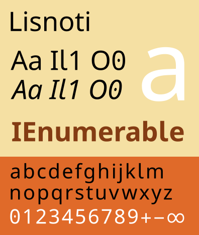

# READ ME

*This repo contains the Lisnoti font files.*



Lisnoti (/lɪzˈnəʊtiː/) is a proportional sans serif font designed for general use
but with particular consideration given to making it work

- in maths, science and actuarial contexts (including equations in LuaLaTeX and Word), and
- for writing computer code.

Lisnoti is available in regular, italic, bold and bold-italic variants in OpenType (`.ttf`) and web (`.woff2`) formats under the [SIL Open Font Licence (OFL)](https://openfontlicense.org/). The current release is **version&#xA0;2.001** (24&#xA0;September 2026).

If you're interested in why Lisnoti exists, please see [this article](https://timgord.com/2024-01/lisnoti-a-proportional-font-that-works-for-coding-too/).

## Getting Lisnoti

There are three ways to use Lisnoti.

### 1. Install it

To get Lisnoti to work on your computer, download [Lisnoti-ttf.zip](https://github.com/Lisnoti/Lisnoti/raw/refs/heads/main/Lisnoti-ttf.zip), unzip it and install the four `.ttf` files in the usual way for your operating system:

- Windows: select the font files, right-click and choose *Install*.
- Mac: open the font files in Font Book.

### 2. Website &ndash; served by the website

Download [Lisnoti-woff2.zip](https://github.com/Lisnoti/Lisnoti/raw/refs/heads/main/Lisnoti-woff2.zip), copy the folder into your site, link its stylesheet, and name the font in your CSS:

```html
<link rel="stylesheet" href="/Lisnoti-woff2/lisnoti.css">
```

```css
body { font-family: Lisnoti, sans-serif; }
```

If you would rather not have a `<link>` in your pages, put this line at the top of your own stylesheet instead and drop the `<link>`.[^import]

[^import]: `@import` has to be the first rule in the stylesheet, before anything else, or browsers ignore it. It also costs a little speed: the browser has to fetch your stylesheet and read its first line before it discovers `lisnoti.css`, where a `<link>` in the head is found and fetched straight away.[^link]

[^link]: A `<link>` is usually one edit, not one per page: most sites put it in a template, a layout or a shared header. Where that is so, the `<link>` is both the tidier and the faster of the two.

```css
@import url("/Lisnoti-woff2/lisnoti.css");
```

Either way, leave `lisnoti.css` in the folder with its font files.[^paths]

[^paths]: The font file names inside `lisnoti.css` are relative to that file, so the fonts are found wherever your own CSS lives. Pasting the `@font-face` rules into your own stylesheet also works, and saves a request, but then the names are relative to *your* file and have to be repointed at the folder.

`lisnoti.css` serves the font by subset: Latin letters plus common characters, Greek, Cyrillic, maths symbols and so on are separate files, and a page fetches only the subsets for the characters it uses. A page of English text fetches about 27&#xA0;KB for each font weight, and the maths and symbol subsets only as and when needed.

> [!NOTE]
> If you would rather have one file per style (about 425&#xA0;KB each), or your page sets decomposed phonetic text (a base letter followed by a combining mark, which needs both to come from one file), use [Lisnoti-woff2-monolithic.zip](https://github.com/Lisnoti/Lisnoti/raw/refs/heads/main/Lisnoti-woff2-monolithic.zip) instead and link its `lisnoti-full.css`.

### 3. Website &ndash; served by lisnoti.com

You don't need to host anything if you don't want to. Simply point at the stylesheet on lisnoti.com instead, either from your web pages (which means they all require this link in their `<head>` section)

```html
<link rel="stylesheet" href="https://lisnoti.com/lisnoti.css">
```

or from the top of your own stylesheet (which is what lisnoti.com itself does)

```css
@import url("https://lisnoti.com/lisnoti.css");
```

The above links deliver the font by subset (which is usually the optimal approach for web pages). If instead you want the monolithic version use `https://lisnoti.com/lisnoti-full.css`.

See [lisnoti.com](https://lisnoti.com/index.html#using-lisnoti-for-websites) for more details.

### Guide to this repo

Each font file format has its own folder and zip file (for easy download).

| Path | Holds |
|:--|:--|
| `Lisnoti-ttf/` | The four desktop fonts: `Lisnoti-Regular.ttf`, `-Italic`, `-Bold`, `-BoldItalic`. |
| `Lisnoti-woff2/` | The web fonts, cut into subsets: 52 `.woff2` files and `lisnoti.css`, which loads only the subsets a page needs. |
| `Lisnoti-woff2-monolithic/` | The web fonts whole, one `.woff2` per style, and `lisnoti-full.css`. |
| `LisnotiCodeWS-ttf/` and `LisnotiCodeWS-woff2-monolithic/` | 'Lisnoti Code WS', an older variant built from Lisnoti&#xA0;1.002 in which the space is 40% wider. It will be replaced by a proper coding family, Lisnoti Code, which is in preparation. |
| `Licence.txt` | The SIL Open Font Licence plus the notices of the Noto fonts from which Lisnoti is built. |
| `images/` | The pictures in this readme. |

## Feedback

If you have comments on Lisnoti, please use [the GitHub repo discussions page](https://github.com/Lisnoti/Lisnoti/discussions).

Please bear in mind that I am not a typography expert, just a frustrated user.

## Key features

> [!NOTE]
> The Lisnoti characters displayed below use pictures because GitHub renders repo files in its own font. The same characters are set in Lisnoti itself at [lisnoti.com](https://lisnoti.com/index.html#key-features).

Lisnoti is derived from [Noto's sans serif fonts](https://fonts.google.com/noto), but with the following adaptions:

1. Reliable distinction of upper case `I`, lower case `l` and one `1`, and of upper case `O` and zero `0`, in every style:

    <picture><source media="(prefers-color-scheme: dark)" srcset="images/distinct-dark.svg"></picture>

1. Consistent arithmetic, comparison, logic, set, *n*-ary and other maths operators, all sitting on one maths axis, e.g.

    - arithmetic: <picture><source media="(prefers-color-scheme: dark)" srcset="images/ops-arithmetic-dark.svg"></picture>
    - comparison: <picture><source media="(prefers-color-scheme: dark)" srcset="images/ops-comparison-dark.svg"></picture>
    - logic: <picture><source media="(prefers-color-scheme: dark)" srcset="images/ops-logic-dark.svg"></picture>
    - set: <picture><source media="(prefers-color-scheme: dark)" srcset="images/ops-set-dark.svg"></picture>
    - *n*-ary: <picture><source media="(prefers-color-scheme: dark)" srcset="images/ops-nary-dark.svg"></picture>
    - other: <picture><source media="(prefers-color-scheme: dark)" srcset="images/ops-other-dark.svg"></picture>

1. An OpenType `MATH` table, so Lisnoti can be chosen as the equation font in Word and loaded by `unicode-math` in LuaLaTeX: fractions, radicals, big operators with limits, stretchy brackets and accents are all set from the font's own data.

1. Greek and Cyrillic letters &ndash; maths and logic make frequent use of Greek letters and occasionally Cyrillic ones too.

1. Consistently formatted digit and &ndash; if available &ndash; Roman letter sub and superscripts:

    - examples: <picture><source media="(prefers-color-scheme: dark)" srcset="images/scripts-example-dark.svg"></picture>
    - superscript: <picture><source media="(prefers-color-scheme: dark)" srcset="images/superscript-dark.svg"></picture>
    - subscript: <picture><source media="(prefers-color-scheme: dark)" srcset="images/subscript-dark.svg"></picture>

1. A reasonable selection of symbols, including

    - squares, diamonds, rectangles, triangles, circles and stars: <picture><source media="(prefers-color-scheme: dark)" srcset="images/shapes-dark.svg"></picture>
    - lots of arrows: <picture><source media="(prefers-color-scheme: dark)" srcset="images/arrows-dark.svg"></picture>
    - ticks and crosses: <picture><source media="(prefers-color-scheme: dark)" srcset="images/ticks-dark.svg"></picture>
    - box drawing: <picture><source media="(prefers-color-scheme: dark)" srcset="images/box-drawing-dark.svg"></picture>
    - game characters: <picture><source media="(prefers-color-scheme: dark)" srcset="images/games-dark.svg"></picture>
    - currency, the whole Unicode currency block U+20A0 to U+20C1 among them: <picture><source media="(prefers-color-scheme: dark)" srcset="images/currency-dark.svg"></picture>
    - misc but useful: <picture><source media="(prefers-color-scheme: dark)" srcset="images/misc-dark.svg"></picture>

1. All the operators [parsed by Julia](https://github.com/JuliaLang/julia/blob/master/src/julia-parser.scm) (which is itself a good test of a technical font).

1. [Unicode mathematical alphanumeric symbols](https://en.wikipedia.org/wiki/Mathematical_Alphanumeric_Symbols):

    <picture><source media="(prefers-color-scheme: dark)" srcset="images/alphanumerics-dark.svg"></picture>

    The script capitals come in both roundhand (the default, `\mathscr`) and chancery (`\mathcal`) styles:

    <picture><source media="(prefers-color-scheme: dark)" srcset="images/script-roundhand-dark.svg"></picture>

    <picture><source media="(prefers-color-scheme: dark)" srcset="images/script-chancery-dark.svg"></picture>

    The chancery forms are reached by Unicode's variation sequence (the capital followed by U+FE00) or by the `ss01` feature, which is what `unicode-math` uses: `\setmathfont{Lisnoti}[range=\mathcal, StylisticSet=1]`.

1. Other standardised variation sequences of maths blocks, each shown here after its base: cups and caps with serifs, circled operators with a white rim, subsets with the stroke through both lower members, relations with a slanted equals, empty set and zero with a slash: <picture><source media="(prefers-color-scheme: dark)" srcset="images/variation-sequences-dark.svg"></picture>

> [!TIP]
> If you want the above but with a monospaced font, then take a look at [Julia Mono](https://juliamono.netlify.app/).

## Equations in Microsoft Word on Windows

Lisnoti can now be used for equations in Word, but there are two potential gotchas that it's worth being aware of:

1. **Always select 'Lisnoti', *not* '@Lisnoti'**. Windows provides the '@Lisnoti' option because of how it handles fonts that include East Asian characters, but this is not what you want.

2. If **Lisnoti is not shown as a font option for equations** and you have previously installed Lisnoti v1 then try
closing all Office programs, and then
the following in a command prompt:
    ```
    reg delete "HKCU\Software\Microsoft\Office\16.0\Common\MathFonts" /v Lisnoti /f
    ```


--------------------------------

# Changelog

> [!NOTE]
> Unlike the key features section above, the glyphs in this changelog are shown in the *display font* so that they can be copied as Unicode. Bear in mind that this means *they may not look like the actual Lisnoti version*.

## v2.001 (2026-09-24)

### Fixed

Corrected the vertical alignment of `∞ ⧜ ⫙ ⟒` and the colon component of the `≔ ≕ ⩴` glyphs to match the maths axis (same as `=`).

The proportional to symbol, `∝`, was redrawn (based on the Noto Sans Math symbol), partly to help distinguish it from the Greek alpha `α`.

Although Lisnoti contained the fullwidth, halfwidth and East Asian characters `｛ ｝￩￪￫￬〒〰円圓`, they were not displayed by Microsoft Word because it categorises them all as East Asian and will only use fonts that declare they support this in the OS/2 field `ulCodePageRange`. The relevant bits have been turned on[^codepage] for Lisnoti&#xA0;v2.001 and Word now displays them in Lisnoti.

[^codepage]: Technically the bits declare Korean support, which Lisnoti does not have. Word and other programs will still fall back to another font for any character Lisnoti lacks, so the only effect is that Word will now use Lisnoti for the characters it does have. (JuliaMono does the same.)

> [!TIP]
> If Word does not offer Lisnoti as an equation font after upgrading from v1, see [Equations in Word](#equations-in-microsoft-word-on-windows).

## v2.000 (2026-09-21)

Lisnoti&#xA0;v2.000 is a complete rebuild of the font:

### Changed

- The base is [Noto Sans](https://fonts.google.com/noto/specimen/Noto+Sans)&#xA0;v2.015 (previously v2.013).

- The maths donor is [Noto Sans Math](https://fonts.google.com/noto/specimen/Noto+Sans+Math)&#xA0;v3.000, Khaled Hosny's 2024 redesign:
    - This shifted the maths vertical alignment axis and redrew and added many glyphs.
    - Notwithstanding Noto's redesign, Lisnoti has itself redrawn the *n*-ary operators, radical sign, tick and cross family and a few other glyphs for consistency and aesthetics.
    - Lisnoti now incorporates an OpenType `MATH` table, built using the same pattern as Noto Sans Math but with Lisnoti glyph measurements. This means that **Lisnoti can now be used to typeset equations**.
- The web font files are now subset by script to optimise web page access. For instance, a Latin-only page downloads about 27&#xA0;KB per weight for Lisnoti&#xA0;v2.000, against 350&#xA0;KB for the whole font previously, i.e. a reduction in download size of over 90%. (The previous monolithic approach is still available if required.)


### Added

- Three currency symbols were added, the last of which completes Lisnoti's coverage of the Unicode currency block, U+20A0 to U+20C1:
    - `৳` (U+09F3) Bangladeshi taka / Bengali rupee sign (from Noto Sans Bengali).
    - `฿` (U+0E3F) Thai baht sign (from Noto Sans Thai).
    - `⃁` (U+20C1) Saudi riyal sign (drawn from the Saudi Central Bank's published artwork).

### Removed

- WOFF ('WOFF&#xA0;1') files are no longer included on the basis that every browser now in use supports WOFF2.

## v1.001 to v1.002 (2023 to 2025)

The original Lisnoti, built by hand in [FontForge](https://fontforge.org/) from
[Noto Sans](https://fonts.google.com/noto/specimen/Noto+Sans) and four of its siblings.
v1.001 was first released in this repository in September 2023 and v1.002 was first released in January 2024 and then re-released four more times up to July 2025 under the same version number[^version-bumping].

[^version-bumping]: Using the same version for different releases of Lisnoti v1 was an oversight. In future, new releases will have higher version numbers.

These initial releases included the following core features of Lisnoti:

- **Clear visual distinction between easily confused characters.**
    - A tail was added to lower case `l` to distinguish it from upper case `I`.
    - A dot was added to the interior of zero `0` to distinguish it from upper case `O`.
    - Lower case alpha `α` was replaced with Noto Sans JP's, because Noto Sans's is too close to a roman `a` in italic.
    
    These changes were propagated e.g. to the `fl` and `ffl` ligatures and accented forms. 

- **Real minus sign.** Noto Sans's italics have no minus sign `−` (U+2212) of their own (they use the hyphen!). Lisnoti provides true minus signs for all styles.

- **Consistent sub and superscripts.** Noto Sans's sub and superscripts are out of alignment with each other,
  so the roman ones were rebuilt from the full-size letters. Later Lisnoti versions added subscripts `w`, `y` and `z` due in Unicode&#xA0;18.0.

- **Maths symbol consistency.** The *n*-ary `⋀ ⋁ ⋂ ⋃` were redrawn based on `∏` to be visually distinct from their binary partners. `∩` and `∪` were made shorter for aesthetic reasons (and to match logical operators). Noto Sans Math's arrows were scaled up by 25%, because they were too small next to the other operators. `∝` and `∞` were enlarged and reshaped by hand.

- **Kerning for code.** `r`/`n` were separated so as not to be read as `m`. The aggressive Noto Sans `r`/`.` pair kerning was halved so that a full stop in `other.value` stays visible. Brackets of the same orientation were spaced apart. Combinations of `'` and `"` were separated so that `''` does not read as `"`.

- **Incorporate additional symbols.** In order to reduce risk of random font substitution, Lisnoti incorporated a selection of shapes, arrows, chess, ticks and box drawings from
  [Noto Sans Symbols](https://fonts.google.com/noto/specimen/Noto+Sans+Symbols),
  [Noto Sans Symbols 2](https://fonts.google.com/noto/specimen/Noto+Sans+Symbols+2) and
  [Noto Sans JP](https://fonts.google.com/noto/specimen/Noto+Sans+JP). Where no bold existed, it was created using emboldening.

