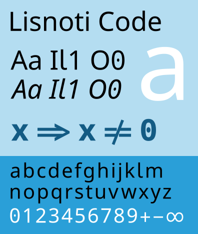
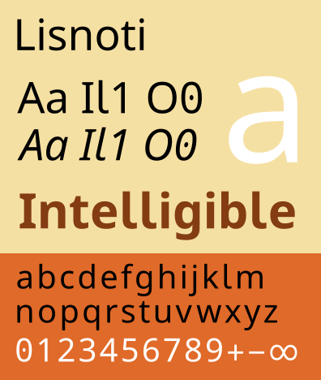

# READ ME

> [!NOTE]
> This repo contains the font files for [**Lisnoti**](https://lisnoti.com/) and [**Lisnoti Code**](https://lisnoti.com/code/).
> 
> For an introduction to the fonts and a chance to try them out go to the [**lisnoti.com**](https://lisnoti.com/) website.




**Lisnoti** (/lɪzˈnəʊtiː/) is a proportional sans serif font designed for general use
but with particular consideration given to making it work consistently in maths, science and actuarial contexts. In addition, Lisnoti includes an OpenType `MATH` table, so it can be loaded by `unicode-math` in LuaLaTeX and used for equations in Microsoft Word.

The initial driver for Lisnoti was the lack of a suitable *proportional* font for writing computer code. While I have used Lisnoti itself as a coding font for a number of years, coding-specific fonts can improve the experience by using ligatures. For this reason, a dedicated **Lisnoti Code** font also exists &ndash; see [below](#lisnoti-code).

If you're interested in why Lisnoti exists, please see [this article](https://timgord.com/2024-01/lisnoti-a-proportional-font-that-works-for-coding-too/).


Lisnoti fonts are available in regular, italic, bold and bold-italic variants in OpenType (`.ttf`) and web (`.woff2`) formats under the [SIL Open Font Licence (OFL)](https://openfontlicense.org/). The current releases are:

|Font family|Folder|Version|Release date|
|:---|:---|---:|:---:|
|Lisnoti | `font-Lisnoti` | 2.004 |2026-09-29|
|Lisnoti Code | `font-LisnotiCode` | 0.902 |2026-09-29|

What has changed in each release is in [changelog-Lisnoti.md](changelog-Lisnoti.md) and [changelog-LisnotiCode.md](changelog-LisnotiCode.md).

## Get Lisnoti

There are three ways to use Lisnoti.

### 1. Install it

To get Lisnoti to work on your computer, download [Lisnoti-ttf.zip](https://github.com/Lisnoti/Lisnoti/raw/refs/heads/main/font-Lisnoti/Lisnoti-ttf.zip), unzip it and install the four `.ttf` files in the usual way for your operating system:

- Windows: select the font files, right-click and choose *Install*.
- Mac: open the font files in Font Book.

For Lisnoti Code, download [LisnotiCode-ttf.zip](https://github.com/Lisnoti/Lisnoti/raw/refs/heads/main/font-LisnotiCode/LisnotiCode-ttf.zip) instead.

### 2. Website &ndash; fonts served by your own site

Download [Lisnoti-woff2.zip](https://github.com/Lisnoti/Lisnoti/raw/refs/heads/main/font-Lisnoti/Lisnoti-woff2.zip), copy the folder into your site, link its stylesheet, and name the font in your CSS:

```html
<link rel="stylesheet" href="/Lisnoti-woff2/lisnoti.css">
```

```css
body { font-family: Lisnoti, sans-serif; }
```

If you would rather not have a `<link>` in your pages, put this line at the top of your own stylesheet instead and drop the `<link>`.[^import]

[^import]: `@import` has to be the first rule in the stylesheet, before anything else, or browsers ignore it. It also costs a little speed: the browser has to fetch your stylesheet and read its first line before it discovers `lisnoti.css`, where a `<link>` in the head is found and fetched straight away.[^link]

[^link]: A `<link>` is usually one edit, not one per page: most sites put it in a template, a layout or a shared header. Where that is so, the `<link>` is both the tidier and the faster of the two.

```css
@import url("/Lisnoti-woff2/lisnoti.css");
```

Either way, leave `lisnoti.css` in the folder with its font files.[^paths]

[^paths]: The font file names inside `lisnoti.css` are relative to that file, so the fonts are found wherever your own CSS lives. Pasting the `@font-face` rules into your own stylesheet also works, and saves a request, but then the names are relative to *your* file and have to be repointed at the folder.

`lisnoti.css` serves the font by subset: Latin letters plus common characters, Greek, Cyrillic, maths symbols and so on are separate files, and a page fetches only the subsets for the characters it uses. A page of English text fetches about 34&#xA0;KB for each font weight, and the maths and symbol subsets only as and when needed.

> [!NOTE]
> If you would rather have one file per style (about 425&#xA0;KB each), or your page sets decomposed phonetic text (a base letter followed by a combining mark, which needs both to come from one file), use [Lisnoti-woff2-monolithic.zip](https://github.com/Lisnoti/Lisnoti/raw/refs/heads/main/font-Lisnoti/Lisnoti-woff2-monolithic.zip) instead and link its `lisnoti-monolithic.css`.

### 3. Website &ndash; fonts served by lisnoti.com

You don't need to host the fonts locally if you don't want to &ndash; lisnoti.com can do this for you instead. An advantage of this approach is that you will always have the latest release on your site.

Simply point at the stylesheet on lisnoti.com instead, either from your web pages (which means they all require this link in their `<head>` section)

```html
<link rel="stylesheet" href="https://lisnoti.com/lisnoti.css">
```

or from the top of your own stylesheet (which is what lisnoti.com itself does)

```css
@import url("https://lisnoti.com/lisnoti.css");
```

The above links deliver the font by subset (which is usually the optimal approach for web pages). If instead you want the monolithic version use `https://lisnoti.com/lisnoti-monolithic.css`.

See [lisnoti.com](https://lisnoti.com/index.html#using-lisnoti-for-websites) for more details.

## Guide to this repo

Each font family has its own folder (beginning `font-`), and within that folder, each font file format has its own folder and zip file (for easy download).

<table>
<thead>
<tr>
<th align="left">Top-level folder</th>
<th align="left">Item</th>
<th align="left">Contents</th>
</tr>
</thead>
<tbody>
<tr>
<td align="left" rowspan="3"><code>font-Lisnoti/</code></td>
<td align="left"><code>Lisnoti-ttf/</code></td>
<td align="left">Desktop font files</td>
</tr>
<tr>
<td align="left"><code>Lisnoti-woff2/</code></td>
<td align="left">Subset web font files and <code>lisnoti.css</code></td>
</tr>
<tr>
<td align="left"><code>Lisnoti-woff2-monolithic/</code></td>
<td align="left">One web font file per style and <code>lisnoti-monolithic.css</code></td>
</tr>
<tr>
<td align="left" rowspan="3"><code>font-LisnotiCode/</code></td>
<td align="left"><code>LisnotiCode-ttf/</code></td>
<td align="left">Desktop coding font files</td>
</tr>
<tr>
<td align="left"><code>LisnotiCode-woff2/</code></td>
<td align="left">Subset web coding font files and <code>lisnoti-code.css</code></td>
</tr>
<tr>
<td align="left"><code>LisnotiCode-woff2-monolithic/</code></td>
<td align="left">One web coding font file per style and <code>lisnoti-code-monolithic.css</code></td>
</tr>
<tr>
<td align="left"><code>font-LisnotiCodeWS (deprecated)/</code></td>
<td align="left" colspan="2">'Lisnoti Code WS', a variant built from Lisnoti&nbsp;1.002 with a 40% wider space. Superseded by Lisnoti Code.</td>
</tr>
<tr>
<td align="left"><code>Licence.txt</code></td>
<td align="left" colspan="2">SIL Open Font Licence plus the notices of the Noto fonts from which the Lisnoti family is built. The licence covers all font families.</td>
</tr>
<tr>
<td align="left"><code>images/</code></td>
<td align="left" colspan="2">Lisnoti and Lisnoti Code font and social cards.</td>
</tr>
<tr>
<td align="left"><code>glyph-images/</code></td>
<td align="left" colspan="2">The glyph images in this README.</td>
</tr>
</tbody>
</table>

## Credit

Lisnoti and Lisnoti Code derive from Google's admirable
[Noto](https://fonts.google.com/noto) fonts.

Lisnoti's math functionality
derives from Khaled Hosny's wholesale redesign of [Noto Sans Math](https://fonts.google.com/noto/specimen/Noto+Sans+Math) in 2024.

## Feedback

If you have comments on Lisnoti, please use [the GitHub repo discussions page](https://github.com/Lisnoti/Lisnoti/discussions).

Please bear in mind that I am not a typography expert, just a frustrated user.

## Lisnoti's key features

> [!NOTE]
> The Lisnoti characters displayed below use pictures because GitHub renders repo files in its own font. [lisnoti.com](https://lisnoti.com/index.html#key-features) shows them set in Lisnoti itself.

[**Lisnoti**](https://lisnoti.com/) is derived from [Noto's sans serif fonts](https://fonts.google.com/noto), but with the following adaptations:

1. Reliable distinction of upper case `I`, lower case `l` and one `1`, and of upper case `O` and zero `0`:

    <picture><source media="(prefers-color-scheme: dark)" srcset="glyph-images/distinct-dark.svg"></picture>

1. Consistent arithmetic, comparison, logic, set, *n*-ary and other maths operators, all on the same maths axis and in a number of cases completely redrawn compared with the Noto source, e.g.

    - arithmetic: <picture><source media="(prefers-color-scheme: dark)" srcset="glyph-images/ops-arithmetic-dark.svg"></picture>
    - comparison: <picture><source media="(prefers-color-scheme: dark)" srcset="glyph-images/ops-comparison-dark.svg"></picture>
    - logic: <picture><source media="(prefers-color-scheme: dark)" srcset="glyph-images/ops-logic-dark.svg"></picture>
    - set: <picture><source media="(prefers-color-scheme: dark)" srcset="glyph-images/ops-set-dark.svg"></picture>
    - *n*-ary: <picture><source media="(prefers-color-scheme: dark)" srcset="glyph-images/ops-nary-dark.svg"></picture>
    - other: <picture><source media="(prefers-color-scheme: dark)" srcset="glyph-images/ops-other-dark.svg"></picture>

1. An OpenType `MATH` table, so Lisnoti can be chosen as the equation font in Word[^word-issues] and loaded by `unicode-math` in LuaLaTeX: fractions, radicals, big operators with limits, stretchy brackets and accents are all set from the font's own data.

1. Greek and Cyrillic letters &ndash; maths and logic make frequent use of Greek letters and occasionally Cyrillic ones too.

1. Consistently formatted digit and &ndash; if available &ndash; Roman letter sub and superscripts:

    - examples: <picture><source media="(prefers-color-scheme: dark)" srcset="glyph-images/scripts-example-dark.svg"></picture>
    - superscript: <picture><source media="(prefers-color-scheme: dark)" srcset="glyph-images/superscript-dark.svg"></picture>
    - subscript: <picture><source media="(prefers-color-scheme: dark)" srcset="glyph-images/subscript-dark.svg"></picture>

1. A selection of useful symbols, including

    - squares, diamonds, rectangles, triangles, circles and stars: <picture><source media="(prefers-color-scheme: dark)" srcset="glyph-images/shapes-dark.svg"></picture>
    - lots of arrows: <picture><source media="(prefers-color-scheme: dark)" srcset="glyph-images/arrows-dark.svg"></picture>
    - ticks and crosses: <picture><source media="(prefers-color-scheme: dark)" srcset="glyph-images/ticks-dark.svg"></picture>
    - box drawing: <picture><source media="(prefers-color-scheme: dark)" srcset="glyph-images/box-drawing-dark.svg"></picture>
    - game characters: <picture><source media="(prefers-color-scheme: dark)" srcset="glyph-images/games-dark.svg"></picture>
    - currency, the whole Unicode currency block U+20A0 to U+20C1 among them: <picture><source media="(prefers-color-scheme: dark)" srcset="glyph-images/currency-dark.svg"></picture>
    - misc but useful: <picture><source media="(prefers-color-scheme: dark)" srcset="glyph-images/misc-dark.svg"></picture>

1. All operators [parsed by Julia](https://github.com/JuliaLang/julia/blob/master/src/julia-parser.scm) (which is itself a good test of a technical font).

1. [Unicode mathematical alphanumeric symbols](https://en.wikipedia.org/wiki/Mathematical_Alphanumeric_Symbols):

    <picture><source media="(prefers-color-scheme: dark)" srcset="glyph-images/alphanumerics-dark.svg"></picture>

    The script capitals come in both roundhand (the default, `\mathscr`) and chancery (`\mathcal`) styles:

    <picture><source media="(prefers-color-scheme: dark)" srcset="glyph-images/script-roundhand-dark.svg"></picture>

    <picture><source media="(prefers-color-scheme: dark)" srcset="glyph-images/script-chancery-dark.svg"></picture>

    The chancery forms are reached by Unicode's variation sequence (the capital followed by U+FE00) or by the `ss01` feature, which is what `unicode-math` uses: `\setmathfont{Lisnoti}[range=\mathcal, StylisticSet=1]`.

1. Other standardised variation sequences of maths blocks, each shown here after its base: cups and caps with serifs, circled operators with a white rim, subsets with the stroke through both lower members, relations with a slanted equals, empty set and zero with a slash: <picture><source media="(prefers-color-scheme: dark)" srcset="glyph-images/variation-sequences-dark.svg"></picture>

> [!TIP]
> If you want the above but with a monospaced font, then take a look at [Julia Mono](https://juliamono.netlify.app/).

[^word-issues]: There are a couple of things to be aware of when using Lisnoti fonts in Word:
    - Word shows the full-width, half-width and East Asian characters `｛｝￩￪￫￬〒〰円圓` in another font, even though Lisnoti has them. Word draws these characters only in fonts that declare East Asian support, but doing that causes problems in Word, such as wider line spacing.
    - If **Lisnoti is not shown as a font option for equations** and you have previously installed Lisnoti v1 then try closing all Office programs, and then the following in a command prompt:
        ```
        reg delete "HKCU\Software\Microsoft\Office\16.0\Common\MathFonts" /v Lisnoti /f
        ```

<a id="lisnoti-code"></a>
## Lisnoti Code

[**Lisnoti Code**](https://lisnoti.com/code/) is Lisnoti with specific adjustments for writing code. It retains Lisnoti's character set and drawings, drops the `MATH` table, and adds the following features:

- **Wide spaces for indentation.** Lisnoti Code sets runs of spaces as extra wide (500&#xA0;units, an en space) to make indentation levels clear, but leaves single spaces at normal width for readability. Where contextual alternates are switched off, as in Safari (see below), every space has the same, still relatively wide, width (380&#xA0;units).
- **A hyphen drawn as a minus**, because in code that's what it usually means. Between two letters, digits or underscores, as in `max-width` or `n-1`, it is shorter.
- **Ligatures** for `==` `===` `!=` `!==`, `<=` `>=`, `->` `<-` `=>`, and F#/Julia/R pipes `|>` `<|` and their multi-bar forms. A ligature is used only when the whole run of operator characters matches it, so `<==` and `-->` stay as they are.
- **Box drawing that lines up with the spaces**, so the output of `tree` and similar tools stays aligned.

Getting Lisnoti Code is similar to [getting Lisnoti](#get-lisnoti):
- To install it, download [LisnotiCode-ttf.zip](https://github.com/Lisnoti/Lisnoti/raw/refs/heads/main/font-LisnotiCode/LisnotiCode-ttf.zip).
- For a website, download [LisnotiCode-woff2.zip](https://github.com/Lisnoti/Lisnoti/raw/refs/heads/main/font-LisnotiCode/LisnotiCode-woff2.zip) and link its stylesheet:

    ```html
    <link rel="stylesheet" href="/LisnotiCode-woff2/lisnoti-code.css">
    ```

    ```css
    code, pre { font-family: 'Lisnoti Code', monospace; }
    ```

    For one file per style, use [LisnotiCode-woff2-monolithic.zip](https://github.com/Lisnoti/Lisnoti/raw/refs/heads/main/font-LisnotiCode/LisnotiCode-woff2-monolithic.zip) instead and link its `lisnoti-code-monolithic.css`.

### Choosing Lisnoti Code features

Whether *contextual alternates* and *standard ligatures* are on or off  depends on the application:

- **VS Code** turns both off unless told otherwise. In `settings.json` set `"editor.fontFamily": "Lisnoti Code"` and `"editor.fontLigatures": true`, or give a feature list instead of `true`, e.g. `"'liga' off, 'calt' on, 'ss05' on"` for the spacing and the arrows only.
- **Word** also turns both off by default. In the Font dialog (Ctrl+D), *Advanced* tab: *Ligatures: Standard Only* turns on `liga`, the *Use Contextual Alternates* box turns on `calt`, and *Stylistic sets* picks one set.
- **Visual Studio** turns both on and has no setting to turn them off.

The *contextual alternates* (`calt`) features are
- vary space length &ndash; wide when next to whitespace and normal otherwise,
- ensure box drawing character widths match the width of a space in a whitespace context, and
- use true hyphen between letters and digits.

> [!NOTE]
> When `calt` is off, the same space width is used everywhere. This space width is
> neither the wide space used in a whitespace context 
> nor the normal space that looks correct between adjacent words and symbols, 
> but somewhere between the two. (It is similar to the now deprecated Lisnoti Code WS font.)

The *standard ligatures* (`liga`) features are
- equality ligatures for `==`, `===`, `!=` and `!==`,
- relation ligatures for `<=` and `>=`, and
- arrow and pipe ligatures for `->`, `<-`, `=>` and `|>` and friends.

If your application allows, you can pick and choose between the above features by turning off `calt` and/or `liga`, and turning on one or more of the following *stylistic set*s:

| Stylistic set | Name | Holds |
|:--|:--|:--|
| `ss02` | Short hyphen | The shorter (true) hyphen applied between letters and digits |
| `ss03` | Equality ligatures | `==` `===` `!=` `!==` |
| `ss04` | Relation ligatures | `<=` `>=` |
| `ss05` | Arrow and pipe ligatures | `->` `<-` `=>` `\|>` `<\|` and the multi-bar pipes |

For example, a web page that wants the arrows but no other ligatures would use

```css
code { font-feature-settings: "liga" 0, "ss05" 1; }
```

> [!WARNING]
> Do not set `"calt" 1` (i.e. switch it on) in your own CSS.
> 
> Safari, and every web browser on an iPhone or iPad, uses WebKit, which gets the narrow and wide spacing feature wrong, resulting in text colliding.
> To protect against this, the Lisnoti Code stylesheets switch `calt` off in WebKit so as to use the in-between space. If you then set `calt` back on, text on your web pages may collide in those browsers.
